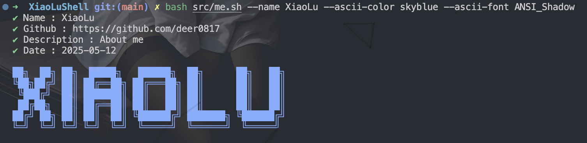
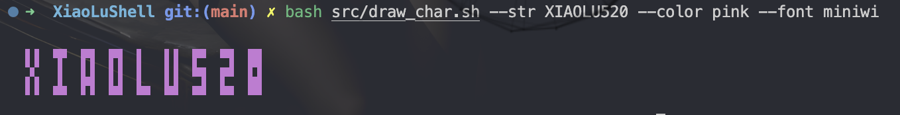

## XiaoLuShell - Interesting Shell Scripts

#### me.sh

> Customizable about me

```sh
Usage: me.sh [OPTIONS]
Options:
  --name <name>           Specify the name (default: deer0817)
  --github <github>       Specify the GitHub link (default: https://github.com/deer0817)
  --desc <description>    Specify the description (default: About me)
  --date <date>           Specify the modified date (default: 2025-05-12)
  --ascii-color <color>   Specify the ASCII color (default: skyblue)
  --ascii-str <string>    Specify the ASCII string (default: XIAOLU)
  --ascii-font <font>     Specify the ASCII font (default: miniwi)
  --list-font             List available fonts
  --list-color            List available ascii colors
  --help                  Show this help message
  --version               Show version information
```


- Quick start

```sh
bash <(curl -sSL https://static.zloved.me/shell/me.sh) --ascii-color cyan
```

#### draw_char.sh

> Customizable ASCII art

```sh
Usage: draw_char.sh [OPTIONS]
Options:
  --font <font_name>       Specify the font name (default: miniwi)
  --font-file <file_path>  Specify the font file path (local or remote)
  --str <string>           Specify the string to draw (default: XIAOLU)
  --color <color_name>     Specify the color (default: plain)
  --to-bash <true|false>   Convert output to bash commands (default: false)
  --list-font              List available fonts
  --list-color             List available colors
  --help                   Show this help message
  --version                Show version information
```



- Quick start

```sh
bash <(curl -sSL https://static.zloved.me/shell/draw_char.sh) --font ANSI_Shadow
```

